# Compose Manager

Compose Manager installs the Docker Compose CLI plugin on your unRAID server and provides a comprehensive web-based interface to create, run, update, back up, and restore Compose stacks directly from the unRAID dashboard. It includes per-stack autostart, scheduled automatic image updates, a rich context menu mirroring the native Docker tab experience, an integrated terminal for live command output, background command execution with notifications, optional UI integration to hide Compose-managed containers, and tooling for testing and CI.

## Screenshots

### Main Compose Manager Interface

#### Compose Page

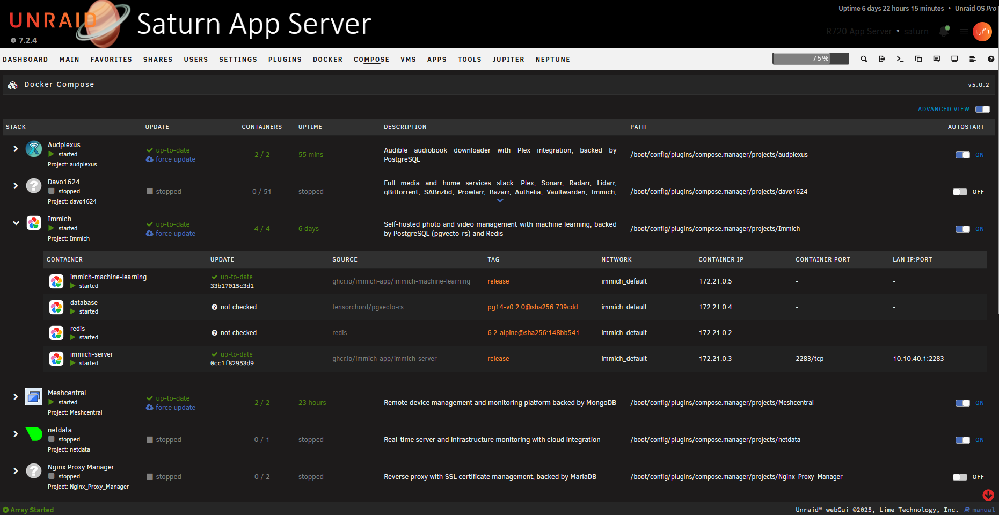

#### Dashboard Integration

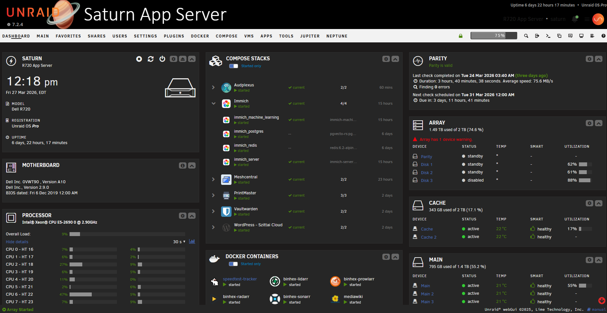

### Stack Editor

The built-in editor provides multiple tabs for managing your compose stack:

#### Compose Tab

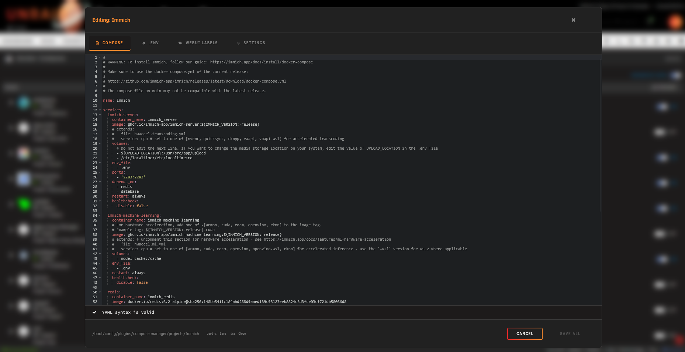

#### Env Tab

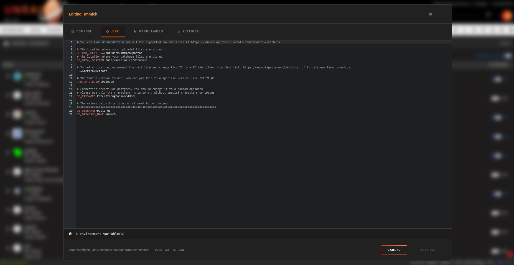

#### WebUI Labels Tab

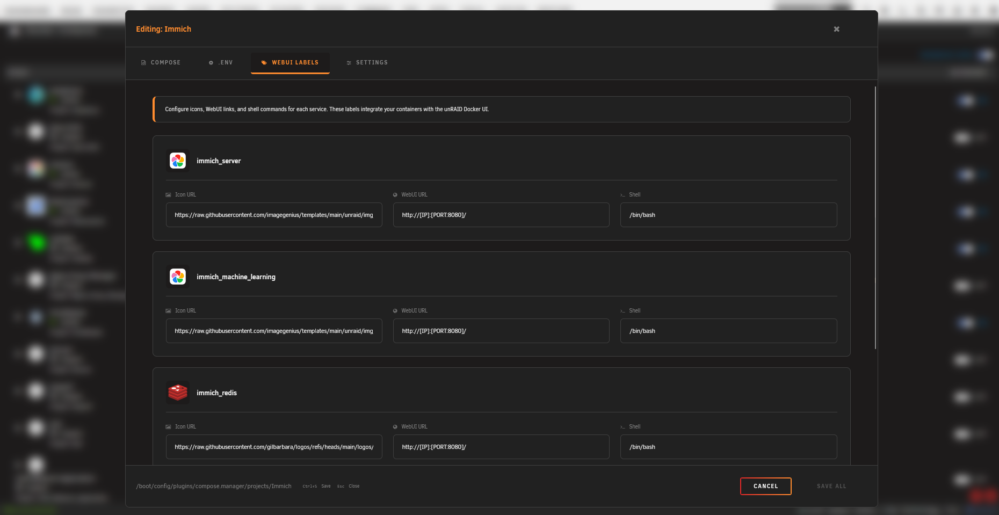

#### Settings Tab

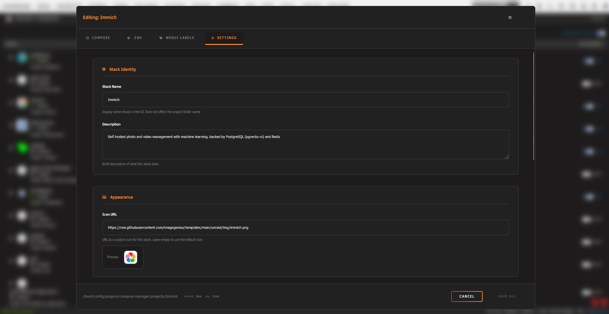

#### Theme Support

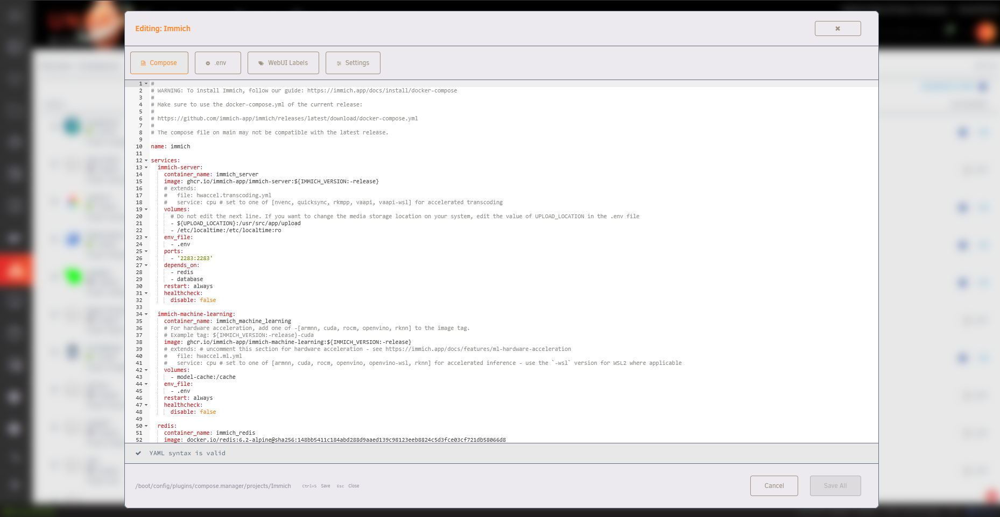

### Settings

#### Settings - Main

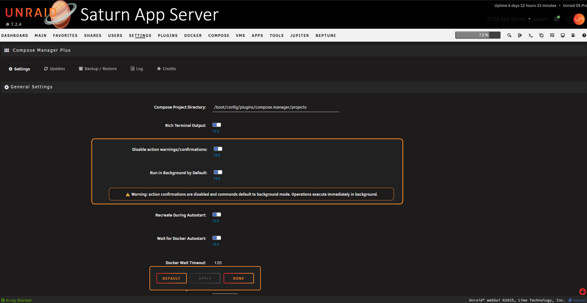

#### Settings - Updates

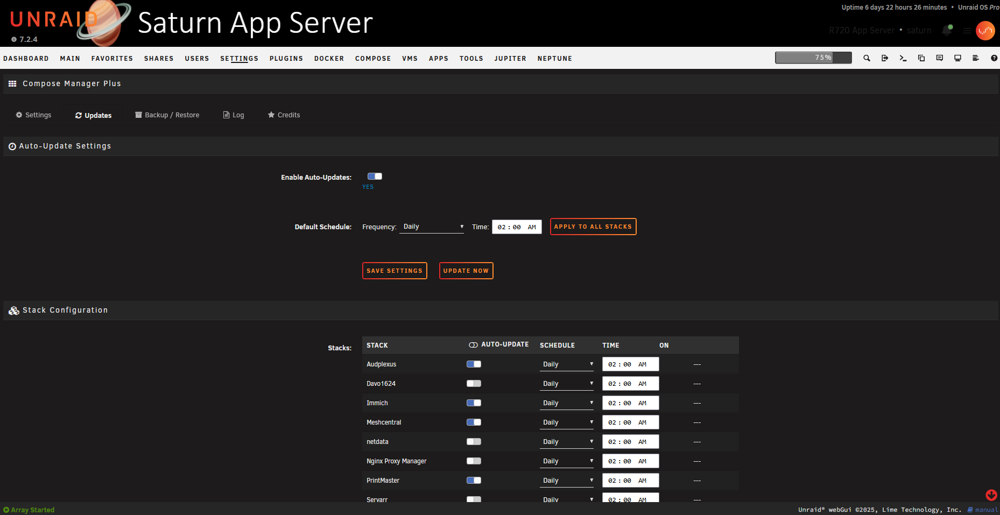

#### Settings - Backups

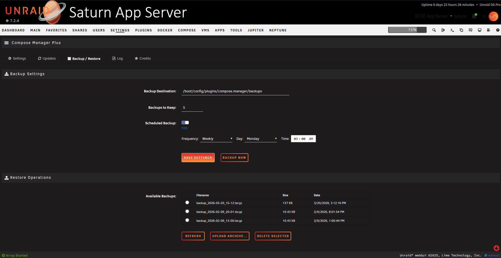

#### Settings - Log Viewer

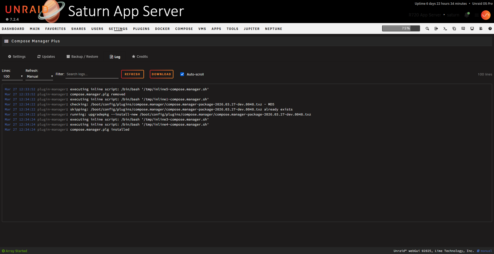

## Features

- **Docker Compose Integration** - Installs the Docker Compose CLI plugin (v5 by default) and manages stacks on your unRAID server.
- **Web UI Management** - Create, edit, and manage Compose stacks directly from the unRAID dashboard.
- **Stack Operations** - Start, stop, restart, update, pull/build, and remove stacks with one click (supports profiles and override files).
- **Context Menu** - Rich context menu on every stack icon with state-aware actions (see [Context Menu](#context-menu) below).
- **Container Context Menu** - Right-click individual containers to open a WebUI, console, or logs; start, stop, pause, resume, or restart individual containers without touching the whole stack.
- **Auto-Updates** - Per-stack scheduled image update checks using SHA-256 digest comparison, with a configurable scheduler, bulk "Run Now", and toggle-all controls.
- **Image Pinning** - Images referenced with a `@sha256:` digest are automatically detected as pinned and will not trigger update alerts.
- **Background Execution** - Any stack action (up, down, update, pull, etc.) can be dispatched in the background; a notification is shown on completion and the UI polls for when the lock is released.
- **Expandable Stack Details** - Click a stack row to expand an inline Docker-tab-style container table showing update status, image source/tag, network, IP, and port mapping for each container.
- **Autostart & Shutdown** - Configurable per-stack autostart with optional force-recreate, wait-for-Docker, and configurable timeouts. Graceful shutdown handling.
- **Visibility & Filtering** - Optionally hide Compose-managed containers from the native Docker UI and Dashboard tile to avoid duplicate entries (behavior varies by unRAID version).
- **Backup & Restore** - Manual and scheduled backups with selective restore from the UI.
- **Web Terminal** - Integrated ttyd terminal for live, colorized compose command output; also supports a basic output mode.
- **Profiles** - Full support for Docker Compose profiles, including multi-profile selection per action.
- **External Paths** - Compose files and env files can live outside the default projects folder (external compose path and env path per stack).
- **Override File Management** - Centralized management of `compose.override.yaml` files, including service rename handling.
- **Stack Editor** - Full-screen modal editor with four tabs: Compose (YAML with live validation), ENV, Web UI Labels (icon/WebUI/shell per service via override file), and Settings (name, description, icon URL, WebUI URL, default profile, external paths). Ctrl+S to save, Esc to close.
- **Basic / Advanced View Toggle** - Toggle between a compact view and an advanced view exposing additional columns (SHA diffs, force-update links) — scoped to the Compose tab to avoid affecting the Docker tab.
- **Compose File Discovery** - Automatically detects all four standard compose file names (`compose.yaml`, `docker-compose.yaml`, `compose.yml`, `docker-compose.yml`).
- **Build Stack Support** - Stacks with a `build:` section in the compose file are detected automatically; context menu and update labels adapt ("Build", "Build & Up", "Update & Rebuild").
- **Indirect Stack Support** - Register a stack pointing to a compose file stored anywhere on the array (outside the projects folder) using an "Indirect Path".
- **Security Hardening** - Path traversal prevention, shell injection hardening with safe argument arrays, XSS escaping throughout, and strict input validation.
- **Developer & Testing Tools** - Unit tests (PHPUnit), integration tests (BATS), static analysis (PHPStan), and CI workflows.

## Installation

### Community Applications

Install via the **Community Applications** plugin in unRAID by going to the 'Apps' tab and searching for 'Compose Manager Plus'.

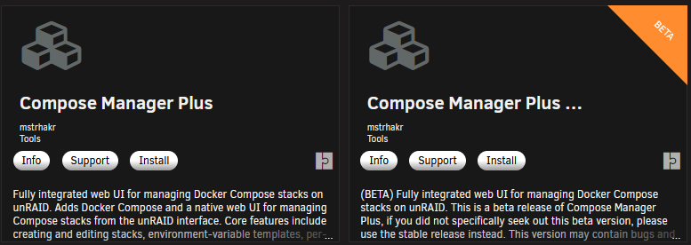

Once there you will see both the main release and the beta release available to be installed. See below if you have Compose Manager already.

### Manual Install

Install manually by navigating to:

**Plugins → Install Plugin** and entering the plugin URL:

Main Release:

```url
https://raw.githubusercontent.com/mstrhakr/compose_plugin/main/compose.manager.plg
```

Beta Release:

```url
https://raw.githubusercontent.com/mstrhakr/compose_plugin/dev/compose.manager.plg
```

### Migration from dcflachs Compose Manager (Depreciated)

When migrating from the original Compose Manager plugin, you can simply press reinstall on Compose Manager Plus to remove the old plugin and install the new one. The plugins both have the same name internally and cannot be installed at the same time. Compose Manager Plus also uses the exact same project folder structure so it will detect all your existing stacks automatically.

Best safe method for migration:

- Compose down for all stacks
- Backup project directory
- Uninstall old plugin
- Install new plugin
- Start up stacks

> NOTE: I have tested upgrading in place by clicking "reinstall" in the CA app store without stopping the stacks and have has no issues personally. The only time this should be an issue is if your project is running with a project name that is different from the sanitized version of your folder name. Thats why it is safest to stop/down all stacks before migration.

### Remove Compose Manager Plus and Re-Install dcflachs Compose Manager

With dcflachs Compose Manager being depreciated, if you want to go back to it you will need to do the following:

- Uninstall Compose Manager Plus
- Get the plugin url from dcflachs GitHub

```url
https://raw.githubusercontent.com/dcflachs/compose_plugin/main/compose.manager.plg
```

- Paste this url into the box in 'Install Plugin's page
- Press install.

## Requirements

- unRAID 6.9.0 or later

> NOTE: This is untested on anything older than 7.2.3 currently. I will remove this note if I get a report that this IS compatible that far back. I am working on getting a machine setup for testing on the older versions. Any advice would be welcome, eg how to VM unraid easily.

- Docker service enabled

## Configuration

Access **Settings → Compose** in the unRAID web UI. Key options:

- **Rich Terminal Output** — Toggle terminal-style live, colorized output (ttyd) versus simpler text output.
- **Projects Folder** — Default: `/boot/config/plugins/compose.manager/projects`. Changing it does not move existing projects.
- **Show Compose in Header Menu** — Adds a Compose tab to the unRAID header navigation and removes it from the Docker tab.
- **Show Dashboard Tile** — Show or hide the Compose stacks summary tile on the unRAID dashboard.
- **Recreate During Autostart / Wait for Docker Autostart** — Autostart behavior controls, plus **Docker Wait Timeout** and **Stack Startup Timeout**.
- **Run in Background by Default** — Action dialogs pre-check "Run in background" and notify on completion.
- **Expand Stacks by Default / Only Expand Running Stacks** — Control how stack rows expand on page load.
- **Auto Check for Updates** — Automatically check image updates on page load with a configurable interval.
- **Hide Compose Containers from Docker** — Hide Compose-managed containers from the Docker page (non-tabbed Docker mode).
- **Hide Compose Containers from Docker Tile on Dashboard** — Hide Compose-managed containers from the Dashboard Docker tile.
- **Backup Settings** — Backup destination, retention, and optional scheduled backups.
- **Debug Logging** — Log detailed compose command output to syslog.

## Usage

### Creating a Stack

1. Navigate to **Docker → Compose** (or **Compose** if the header menu option is enabled)
2. Click **Add Stack**
3. Enter a name and optionally a description
4. Optionally expand **Advanced Options** and enter an **Indirect Path** if the compose file lives outside the default projects folder
5. The stack editor opens automatically — add your `compose.yaml` content
6. Click **Compose Up** to start the stack

### Managing Stacks

#### Context Menu

Right-click (or left-click) the stack icon to open the context menu. Available actions depend on the stack's current state:

**When Running:**

- **WebUI** — Opens the configured WebUI URL in a new tab (if set)
- **Compose Down** — Stop and remove all containers
- **Compose Stop** — Stop containers without removing them
- **Compose Restart** — Recreate containers without pulling
- **Update** / **Update & Rebuild** — Pull latest images and recreate (shown when updates are detected; label changes to "Update & Rebuild" for build stacks)
- **Force Update** / **Force Update & Rebuild** — Pull and recreate even when no updates are detected
- **Check for Updates** — Run an immediate SHA-256 digest check for this stack
- **Edit Stack** — Open the full editor modal
- **View Logs** — Open a live `docker compose logs -f` terminal window
- **View Last Cmd Log** — Show the saved output of the last command run for this stack
- **Delete Stack** *(disabled while running)*

**When Stopped:**

- **Compose Up** — Create and start all containers
- **Pull** / **Build** — Pull or build images without starting (label is "Build" for build stacks)
- **Pull & Up** / **Build & Up** — Pull/build and then start
- **Check for Updates**, **Edit Stack**, **View Logs**, **View Last Cmd Log**, **Delete Stack**

All actions that support Docker Compose profiles will show a profile selector when profiles are defined.

#### Container Context Menu

Expand a stack row and right-click (or left-click) a container's icon:

- **WebUI** — Open the container's WebUI (if configured and running)
- **Console** — Open a live interactive terminal inside the container via ttyd
- **Stop / Pause / Restart** — Manage the individual container
- **Start / Resume** — For stopped or paused containers
- **Logs** — Open a `docker logs -f` terminal window for this container

#### Action Dialogs

When confirming a stack action, the dialog shows all containers with their current image tag, update status, and a SHA-256 diff (current → new) for any pending updates. A **Run in background** checkbox lets you dispatch the command without a terminal window; a notification pops up when it finishes.

### Auto-Updates

Navigate to the **Auto-Updates** section (toolbar button on the Compose page) to configure per-stack automatic updates:

- Enable or disable the scheduler globally
- Set a schedule per stack (daily, weekly, etc.)
- Use **Toggle All** to enable/disable all stacks at once
- Use **Run Now** to trigger an immediate update check for a stack
- Requests are serialized to avoid overwhelming the server

The runner (`autoupdate_runner.php`) is invoked by cron and compares image digests before pulling, so updates only happen when a new image is actually available.

### Image Pinning

If a service in your `compose.yaml` references an image with a digest (e.g. `redis:7@sha256:abc123...`), Compose Manager automatically marks it as **pinned**. Pinned containers display a cyan thumbtack badge in the update column and are skipped during update checks.

### Bulk Actions

The toolbar provides **Start All**, **Stop All**, and **Update All** buttons. An **Autostart Only** toggle filters these operations to stacks that have autostart enabled.

### Autostart

Enable autostart for a stack by clicking the autostart toggle. Stacks will automatically start when the unRAID array starts, with optional force-recreate and configurable wait timeouts.

## Documentation

For detailed guides, see the [docs](docs/) folder:

- [Getting Started](docs/getting-started.md)
- [User Guide](docs/user-guide.md)
- [Configuration](docs/configuration.md)
- [Profiles](docs/profiles.md)

## Development & Testing 🔧

Quick start:

- Install PHP dependencies: `composer install` (required to install PHPUnit and tooling).
- Run unit tests: `php vendor/bin/phpunit --config phpunit.xml` (or `php vendor/bin/phpunit --testsuite unit`).
- Run a single test file: `php vendor/bin/phpunit --config phpunit.xml tests/unit/ExampleTest.php`.

Integration tests:

- Add and initialize the `plugin-tests` submodule (if not already present):
  - If the submodule is configured: `git submodule update --init --recursive`
  - Or add it manually: `git submodule add https://github.com/mstrhakr/plugin-tests.git tests/plugin-tests && git submodule update --init --recursive`
- See `tests/plugin-tests/README.md` for running integration suites and environment setup.

Static analysis:

- `composer run analyse` (runs PHPStan configured for this project).

For full developer setup, test running, and contribution guidelines see `docs/development.md`. (Contains examples for coverage, CI notes, and integration testing tips.)

## Release Process

Releases are fully automated via GitHub Actions. **No local scripts or manual tagging required.**

### How it works

1. **Merge a PR to `main` (stable) or `dev` (beta).**
2. The `tag-release.yml` workflow automatically:
   - Generates a date-based version tag (`v2026.03.15` for stable, `v2026.03.15-dev.HHMM` for beta)
   - Updates the PLG changelog from conventional commit messages
   - Pushes the tag
3. The tag triggers `build.yml`, which:
   - Builds the TXZ package in a Slackware Docker container
   - Creates a GitHub Release with the package attached
   - Updates the PLG file version and MD5 hash in the target branch

### Branching model

| Branch | Purpose | Release type | Tag format |
| ------ | ------- | ------------ | ---------- |
| `main` | Stable releases | Full release | `v2026.03.15`, `v2026.03.15a` |
| `dev` | Beta/testing | Pre-release | `v2026.03.15-dev.1430` |

- Work on `dev`, open a PR to `main` when ready to promote to stable.
- Same-day stable releases get an auto-incrementing letter suffix (`a`, `b`, `c`, ...).
- Beta releases use a UTC timestamp suffix for uniqueness.

### Manual override

Use the `workflow_dispatch` trigger on `build.yml` in the Actions tab to manually build any version without tagging.

Contributions are welcome — we added issue and PR templates to guide reports and pull requests. Please follow the templates when submitting issues or PRs.

## Support

- [GitHub Issues](https://github.com/mstrhakr/compose_plugin/issues)
- [unRAID Forums](https://forums.unraid.net/)

## License

This project is open source. See the repository for license details.

## Credits

Originally created by **dcflachs**. This fork maintained by **mstrhakr**.
Huge thanks to the entire Unraid community, without you this would be impossible.
